# MK-Stair-Sensors
This project was to help expand my smarthome and learn a bit more about combining various things together

## Project Goal

Use multiple Sensors at the top and buttom of stairs to enable "stairs in use detection" and illuminate based upon it (if its dark)

integrate additional external device (doorbell chime)

Do these things without perminent modification to the house. e.g. drilling the wall for mounting or getting power to devices.

## The Plan
Use  Everything Presence Lite's (EPL) for detection

Use a RGB smartbulb for illumination (and also potential for being used for notifications by changing colour etc...)

Using the exposed GPIO to drive doorbell chime via relay

## Downstairs sensor
There is a prexisting mains powered doorbell chime (that was actually disused) mounted on the wall which I made my target for setting up this sensor as it has power already routed to it.

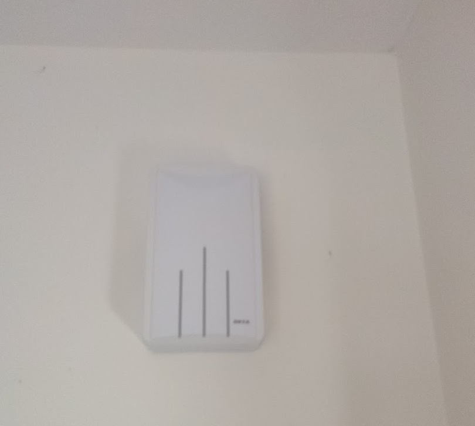

I opted to buy a doorbell exactly the same so i could study plan and modify without touching the orginal with the eventual plan to be building the modifications into the front panel then switching it over and then keep the orginal cover so that I can quickly switch it back and it looks like nothing ever happened.

Please note that in some photos i am using a devboard in place of a EPL because I did not yet have them as I was awaiting the restock.

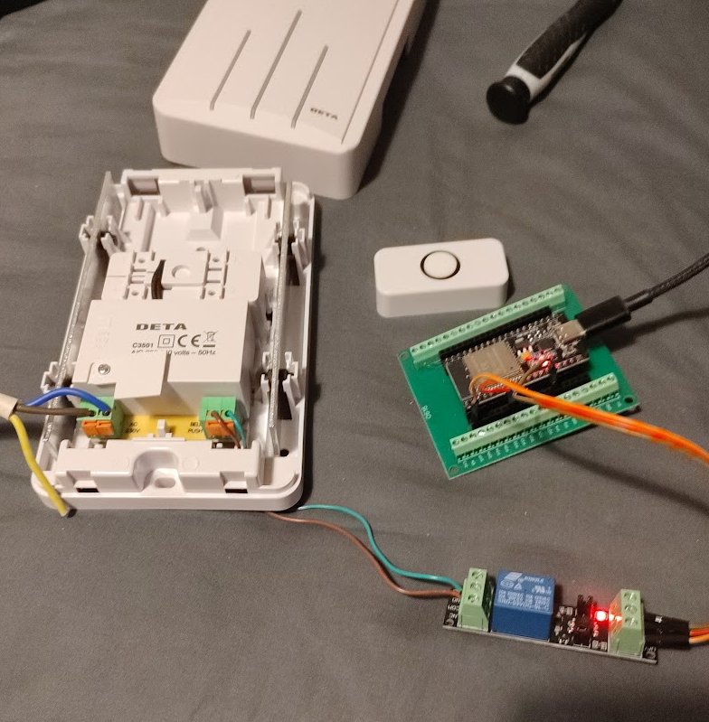

A hole in the doorbell casing and the electronics box which is bolted onto it allows for cables to pass through

This allows for mains power to enter the box and for 2 cables to exit to connect to the chime button connections

The bulb holder was liberated from a cheap lamp bought for the purpose of taking apart to get this part of it.

the mains uses a wago connector to split to both the bulb holder and a 5v 600ma power supply which powers the EPL

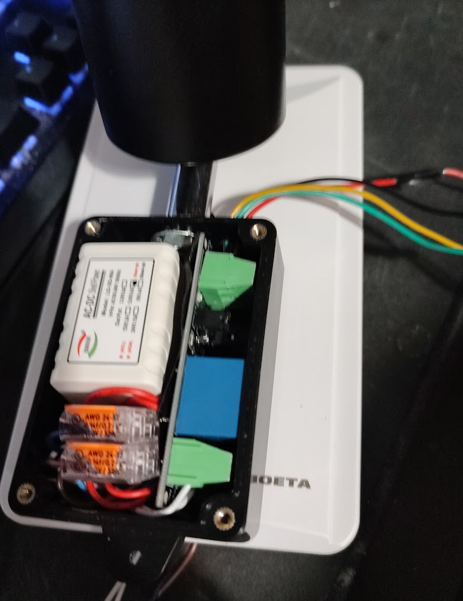

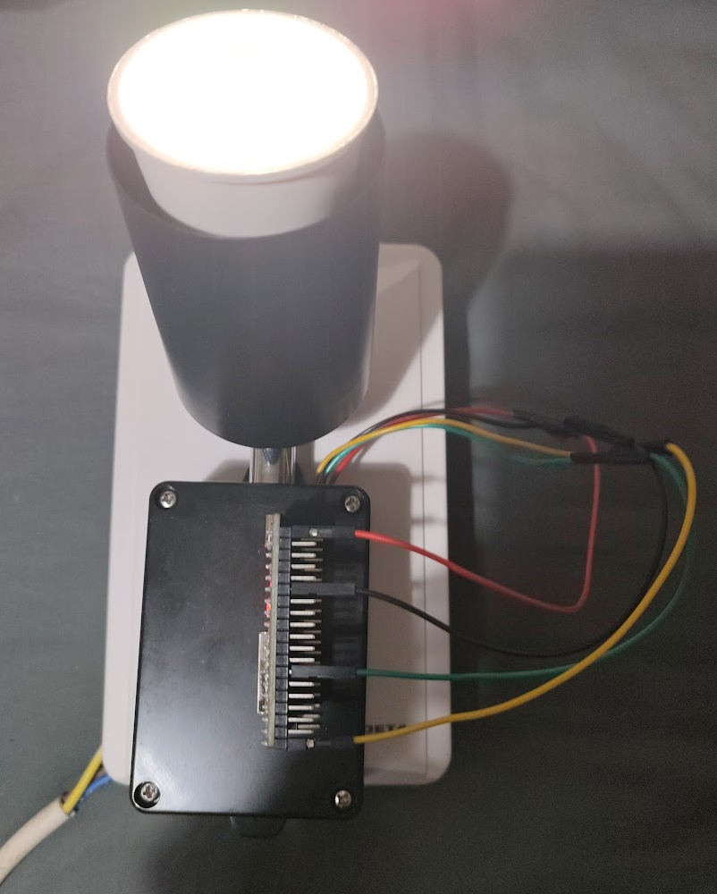

the EPL then outputs 2 cables back into the box which provide 3.3v and a GPIO pin to a relay (which gets its ground directly from the 5v PSU) This relay then Signals the chime switch

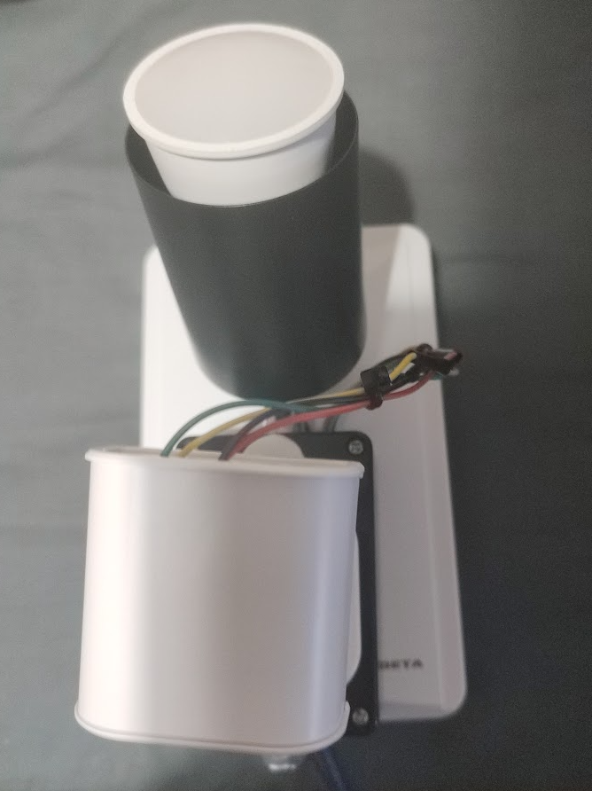

The relay board used is definetly over rated for this particular job however it is what I had and it fits

Attaching the EPL to the front was done with command strips, I was considering using small bolts but the space in the box is already a bit light so I opted to just stick it on.

It was then a matter of modifying the firmware of the EPL to add functionality to drive the relay. This was done by adding the following:

````
switch:
  - platform: gpio
    pin: GPIO32
    inverted: true
    id: doorbell_relay
    name: "Doorbell-Relay"
    icon: "mdi:door"
    on_turn_on:
    - delay: 200ms
    - switch.turn_off: doorbell_relay

button:
  - platform: template
    name: "Ding-Dong"
    on_press:
      - switch.turn_on: doorbell_relay
````

once in use the switch is hidden in home assistant and the button is what is used however it was handy to have during testing/troubleshooting

As if by magic we get a new button on home assistant that makes it go "Ding-Dong". this also means i can trigger it from the ring doorbell which it was not attached to previously. so it has actually regained its purpose as a doorbell chime during this process.

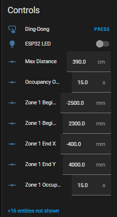

The reason for going for a perminently powered smartbulb instead of a relay driven bulb was for nicer and smoother control and options into the future for differnt ways of displaying things and have it fade up and down in a controlled way independant of the relay powering it up and down.

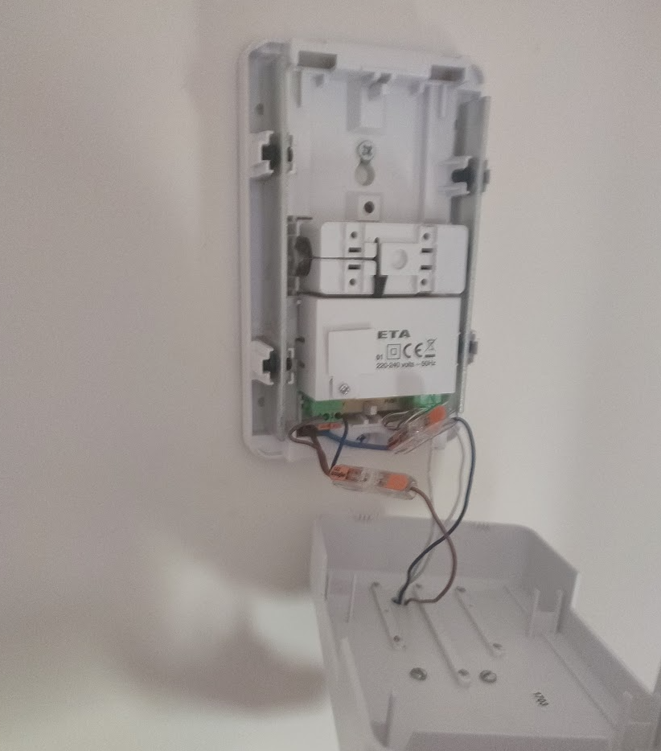

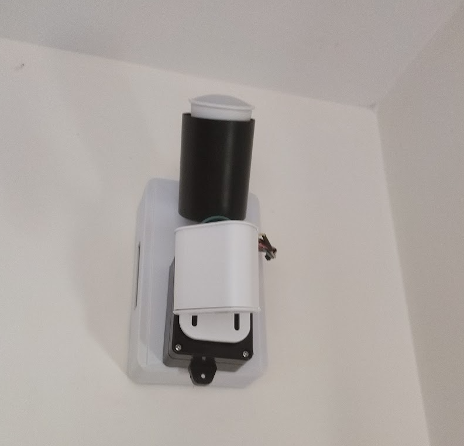

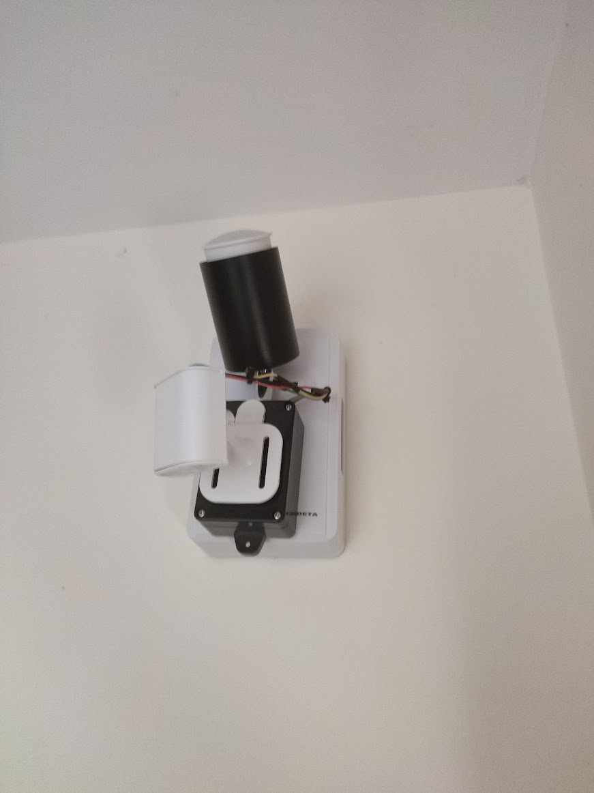

## Upstairs Sensor
This was a bit harder to come up with a plan for mounting/powering but eventually I came up with the idea to piggy back off the high up light switch that controls the light in the loft space. NB: Piggy backing from a light switch in this way only works if there are neutrals at the switch.

Using a single gang light switch/socket spacer which is designed to give a little more space inside the backbox if you are short on space there. I had something solid i could mount to and modify and could be easily removed in the future.

using a dremel I grinded outpart of the plastic to give me a flat surface to drill through and bolt to an electronics box to house my setup. initally tried m3 bolts but they were a little big and were hard to get attached to the box as the holes are close to its base. however after switching to m2 bolts this was no longer an issue. 

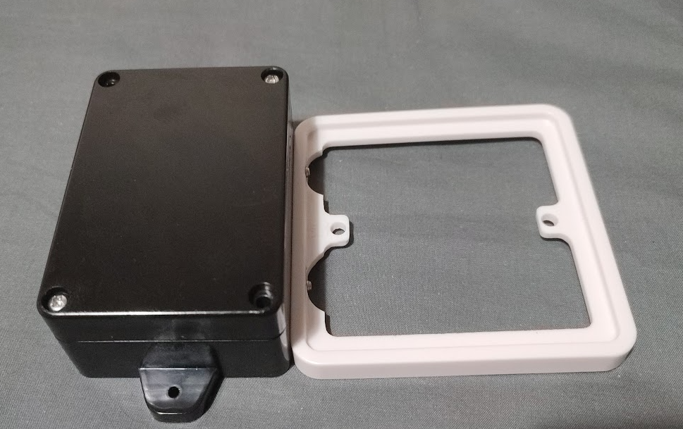

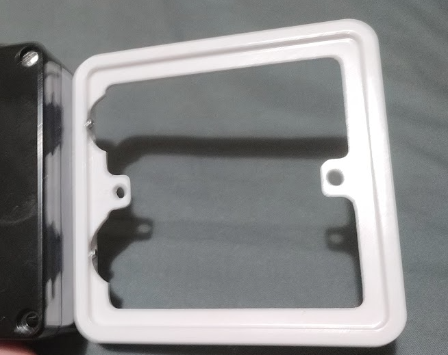

then added a couple of additional holes for cable routing between the backbox and the electronics box and mains power was now where I needed it to be

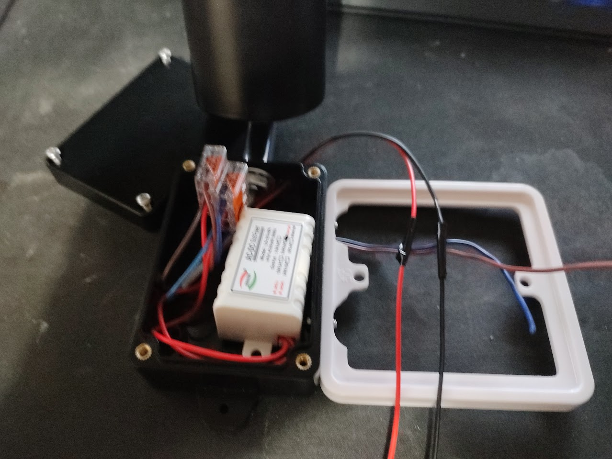

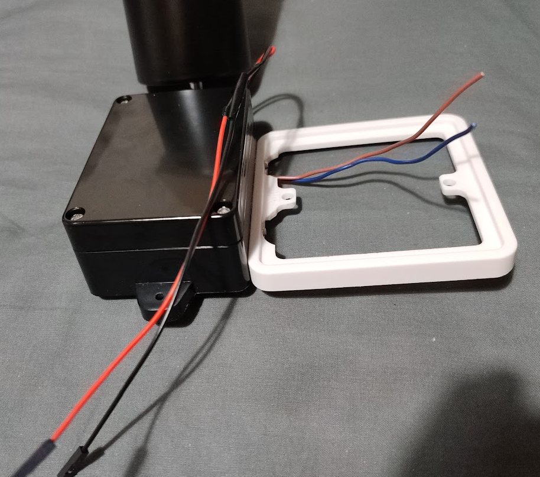

As with the above sensor a wago splits the mains to the bulb holder and a 5v 600ma power supply which provides power to the EPL

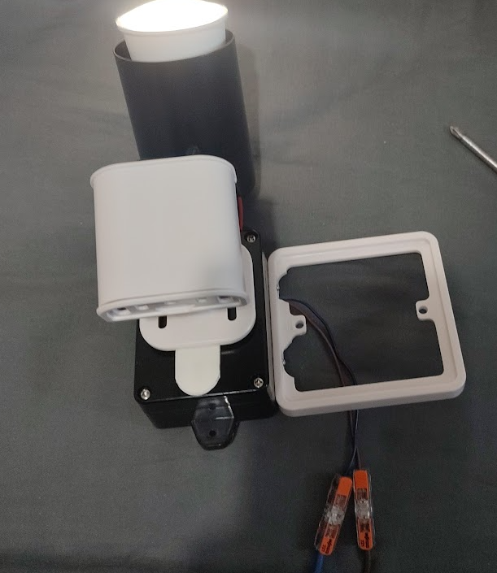

This currently haas no additional hardware to drive so no modification was required this time.

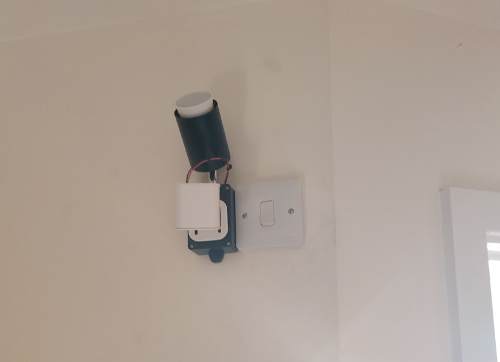

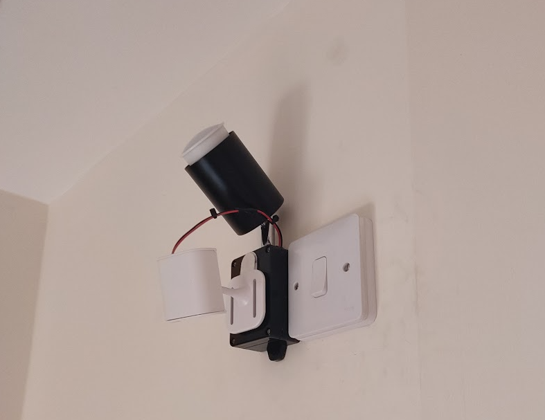

## setting up the detection
After a fair amount of tinkering with distance limiting and zone setup I managed to get a zone on each to detect their side of the stairs to the point where someone on/at the stairs will be in the zone but someone walking by them will not be. (this is still a work in progress and further tinkering is required but I am happy with it for now)

These zones are then used by a templated binary sensor helper called "Stairs in Use"

````
{{ is_state('binary_sensor.everything_presence_lite_f1b9fc_zone_1_occupancy', 'on') 
            or
            is_state('binary_sensor.everything_presence_lite_64ef84_zone_1_occupancy', 'on') 
            }}
````

this helper is then used in an automation to trigger if someone is there and if either sensor detects low lighting via the illuminance sensor on the EPL it will fade up the lights on both sides

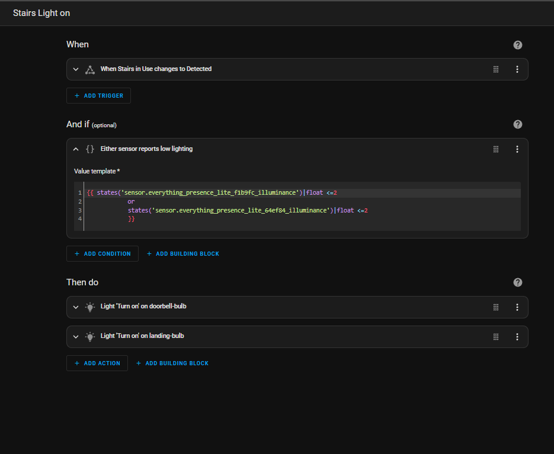

A second automation will then fade the lights back down when the "Stairs in Use" helper clears


## Conclusion
This project was great and whilst only a small modification to the EPL has helped me start to get comftable with adding additional thing to other ESP devices and potentially using more EPL's (or EP1's) in future projects to interact with other things in addition to being the great sensors that they are.

They require a bit more tinkering to get detection perfect, which is a matter of tracking down any false positives and false negitives but that is all part of the process.

I also want to add extra zones so the sensors which will trigger different automations in the future but I havent quite worked out what that is going to look like yet. however the flexibility of this setup gives me alot of options and something to build on.

I am considering adding more devices using ESPresense or simalr to detect which "zone" of the house people are in and be able to trigger automations based upon who is in what room. I may add this functionality to these setups or I may go a different way about installing this setup. but either way the methods used here in adding devices around the house without perminent modification will come into play.

## What could be done differently?

In both cases a better looking and possibily better functioning setup could have been made but custom designing and 3d printing parts to house the setups.

I do not currently own a 3d printer adn i do not know how to 3d model however as I do various projects getting a 3d printer and learning the modeling is definetly something that I will be seriously considering in the future.

Instead of using lighting built into the setups using smart bulbs in already overhead lights does make more sense and eventually I want to do away with all switches but for now and for the sake of other people wanting to be able to use the prexisting lights as normal during transition to smart house this was the way to go. It also allows for potential automations using the RGB to its advantage to give feedback

## Credits and additional reading

Everything Smart Home for designing the EPL/EP1 sensors - https://www.youtube.com/@EverythingSmartHome

Everythingsmart Shop for buying the EPL/EP1 - https://shop.everythingsmart.io/

ESPhome GPIO Switch Compnent Documentation - https://esphome.io/components/switch/gpio.html

ESPHome Button Component Documentation - https://esphome.io/components/button/index.html

